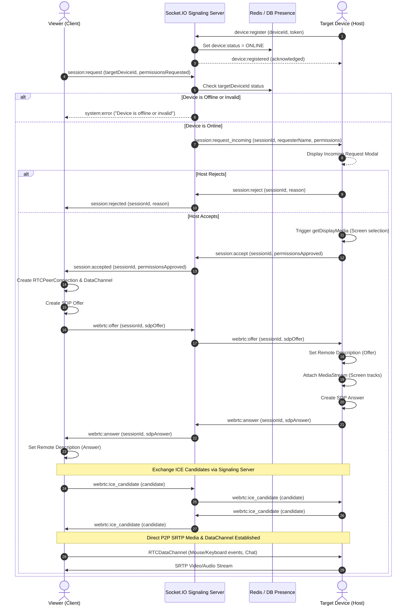

# WebRTC & Signaling Flow

This document details the step-by-step negotiation sequence between the Viewer (Requester) and Host (Target Device).

## Signaling Sequence



## Control Message Formats (RTCDataChannel)

Data channel label: `beamdesk-control` (ordered, reliable).

### Mouse Event
```json
{
  "type": "control:mouse",
  "data": {
    "action": "mousemove",
    "x": 0.4523,
    "y": 0.6120,
    "button": 0
  }
}
```

### Keyboard Event
```json
{
  "type": "control:keyboard",
  "data": {
    "action": "keydown",
    "key": "Enter",
    "code": "Enter",
    "altKey": false,
    "ctrlKey": false,
    "shiftKey": false,
    "metaKey": false
  }
}
```

### Chat Message
```json
{
  "type": "session:chat",
  "data": {
    "senderId": "user-uuid",
    "senderName": "Alex",
    "text": "Can you see the settings dialog?",
    "timestamp": 1727271900000
  }
}
```
